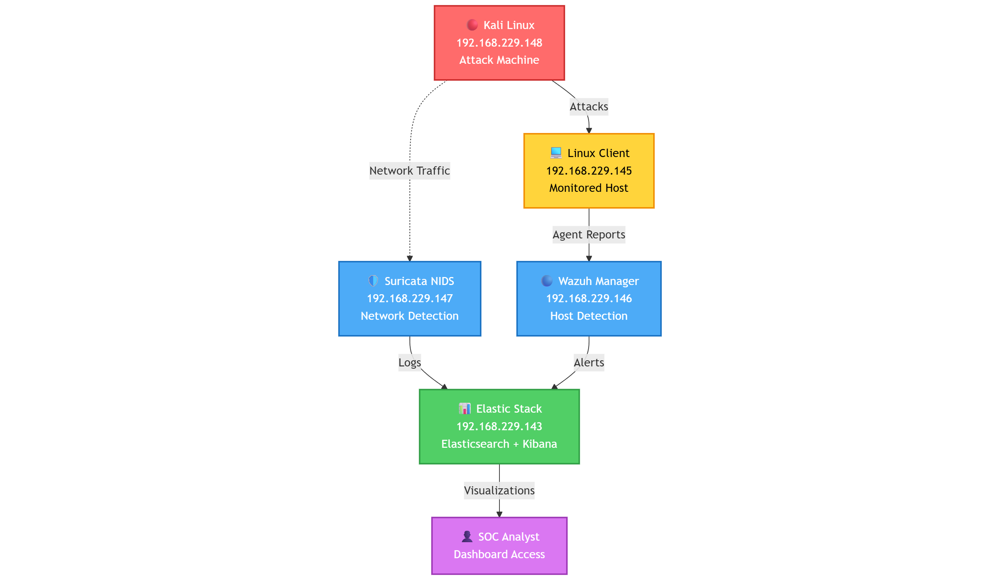
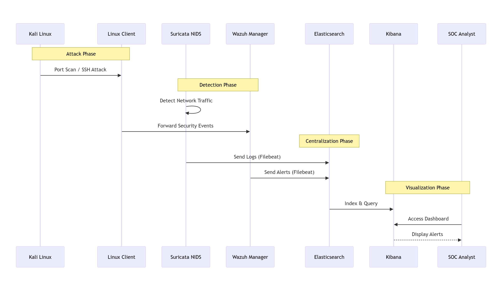
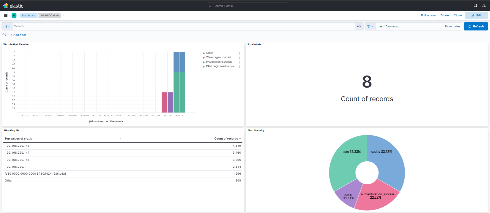
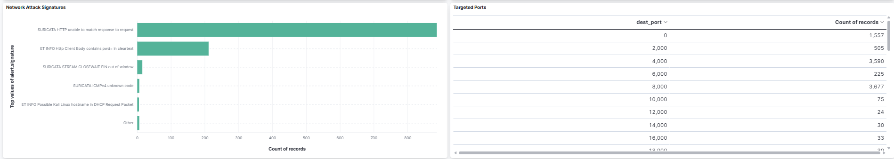

<div align="center">

# 🛡️ Mini-SOC: Plateforme de Détection d'Intrusion et Gestion d'Alertes

### Détection d'Intrusion Réseau & Hôte avec Intégration SIEM

[](https://github.com)
[](LICENSE)
[](https://www.vmware.com)
[](https://ubuntu.com)

<p align="center">
  <strong>Projet Académique de Cybersécurité • Janvier 2026</strong><br>
  <em>Encadré par:</em> <strong>Houcemeddine HERMASSI</strong><br>
  <em>Réalisé par:</em> <strong>Nidhal Chelhi & Rochdi Fridhi</strong>
</p>

---

[](https://suricata.io)
[](https://wazuh.com)
[](https://www.elastic.co)
[](https://www.elastic.co/kibana)
[](https://www.kali.org)

[📖 Documentation](#-documentation) • [🏗️ Architecture](#%EF%B8%8F-architecture) • [🚀 Fonctionnalités](#-fonctionnalités) • [🧪 Tests](#-scénarios-de-tests) • [📊 Dashboards](#-dashboards--visualisations)

</div>

---

## 📋 Description du Projet

Ce projet consiste en la conception, le déploiement et la validation d'une plateforme complète de **mini Security Operations Center (SOC)** combinant la détection d'intrusions réseau et hôte avec la gestion centralisée des événements de sécurité (SIEM).

### 🎯 Composants Principaux

| Composant            | Rôle                           | Technologie                            |
| -------------------- | ------------------------------ | -------------------------------------- |
| **NIDS**             | Détection d'Intrusion Réseau   | Suricata avec règles Emerging Threats  |
| **HIDS**             | Détection d'Intrusion Hôte     | Wazuh Manager + Agent                  |
| **SIEM**             | Centralisation & Visualisation | Elastic Stack (Elasticsearch + Kibana) |
| **Collecte de Logs** | Collecte de Données            | Filebeat                               |
| **Tests**            | Validation de Sécurité         | Kali Linux (Nmap, Metasploit, Hydra)   |

### 💡 Objectifs du Projet

✅ Déployer un système de détection d'intrusion distribué (IDS)  
✅ Implémenter une surveillance et alerte de sécurité en temps réel  
✅ Centraliser les logs de sécurité de plusieurs sources  
✅ Créer des dashboards de sécurité opérationnels  
✅ Valider les capacités de détection par tests d'intrusion  
✅ Documenter une architecture de sécurité de niveau entreprise

---

## 🏗️ Architecture

### 📡 Infrastructure Réseau

```
Réseau: 192.168.229.0/24 (VMware NAT/Bridge)
Passerelle: 192.168.229.2
Total VMs: 5 Ubuntu 22.04 (+ 1 Kali Linux)
```

### 🖥️ Machines Virtuelles

| Composant             | Adresse IP      | Rôle                          | Specs          |
| --------------------- | --------------- | ----------------------------- | -------------- |
| **🟢 Elastic Stack**  | 192.168.229.143 | SIEM (Elasticsearch + Kibana) | 4GB RAM, 2 CPU |
| **🔵 Wazuh Manager**  | 192.168.229.146 | Gestionnaire HIDS             | 2GB RAM, 2 CPU |
| **🟡 Suricata NIDS**  | 192.168.229.147 | Détection Réseau              | 2GB RAM, 2 CPU |
| **🟠 Linux Client-1** | 192.168.229.145 | Hôte Surveillé (Wazuh Agent)  | 2GB RAM, 1 CPU |
| **🔴 Kali Linux**     | 192.168.229.148 | Machine d'Attaque/Tests       | 4GB RAM, 2 CPU |

### 📐 Diagrammes d'Architecture

<details>
<summary><b>🔹 Architecture Système</b></summary>



_Architecture complète montrant les couches de détection, flux de données et intégration SIEM_

</details>

<details>
<summary><b>🔹 Flux de Données</b></summary>



_Flux de données de bout en bout depuis la détection d'attaque jusqu'à la visualisation_

</details>

---

## 🚀 Fonctionnalités

### 🛡️ Détection d'Intrusion Réseau (NIDS)

**Technologie:** Suricata 7.0 avec règles Emerging Threats

- ✅ Surveillance du trafic réseau en temps réel
- ✅ Détection de scans de ports (Nmap, Masscan)
- ✅ Identification du trafic HTTP malveillant
- ✅ Détection de tentatives d'exploitation
- ✅ Détection d'anomalies de protocole
- ✅ Capacité de création de règles personnalisées

### 🔒 Détection d'Intrusion Hôte (HIDS)

**Technologie:** Wazuh Manager 4.x + Agents

- ✅ Détection de brute force SSH
- ✅ Surveillance des tentatives de connexion échouées
- ✅ Surveillance de l'intégrité des fichiers (FIM)
- ✅ Détection de rootkits
- ✅ Analyse des logs système
- ✅ Évaluation de la configuration de sécurité
- ✅ Alertes en temps réel

### 📊 SIEM & Centralisation

**Technologie:** Elastic Stack (Elasticsearch 8.x + Kibana 8.x)

- ✅ Collecte centralisée des logs de toutes les sources
- ✅ Indexation et recherche en temps réel
- ✅ Dashboards de sécurité personnalisés
- ✅ Corrélation et enrichissement des alertes
- ✅ Analyse des données historiques
- ✅ Intégration de threat intelligence

### 📈 Visualisations Dashboard

**Dashboards Kibana Interactifs:**

| Visualisation              | Description                                        |
| -------------------------- | -------------------------------------------------- |
| **Timeline des Alertes**   | Évolution temporelle des événements de sécurité    |
| **Compteur Total Alertes** | Agrégation des alertes en temps réel               |
| **IPs Attaquantes**        | Top IPs sources malveillantes avec géolocalisation |
| **Sévérité des Alertes**   | Distribution par niveau de criticité               |
| **Signatures Réseau**      | Correspondances de règles Suricata et patterns     |
| **Ports Ciblés**           | Services et ports les plus attaqués                |
| **Statut des Agents**      | Surveillance de la santé des agents Wazuh          |

---

## 🧪 Scénarios de Tests

Tests de sécurité complets effectués depuis Kali Linux (192.168.229.148):

### Test 1: Scan de Ports

```bash
# Scan TCP SYN Nmap
nmap -sS 192.168.229.145

# Détection: ✅ Suricata NIDS
# Alerte: ET SCAN Nmap Scripting Engine User-Agent Detected
# Sévérité: Moyenne
```

### Test 2: Brute Force SSH

```bash
# Attaque SSH Hydra
hydra -l root -P /usr/share/wordlists/rockyou.txt ssh://192.168.229.145

# Détection: ✅ Wazuh Agent + Manager
# Alerte: Multiples échecs d'authentification SSH
# ID Règle: 5710, 5712
# Sévérité: Haute
```

### Test 3: Trafic HTTP Malveillant

```bash
# Tentative de Path Traversal
curl http://192.168.229.145/../../etc/passwd

# Test d'Injection SQL
curl "http://192.168.229.145/login?user=admin' OR '1'='1"

# Détection: ✅ Suricata NIDS
# Alerte: ET WEB_SERVER Possible Path Traversal
# Sévérité: Moyenne-Haute
```

### Résumé des Résultats de Tests

| Type d'Attaque         | Système de Détection | Temps de Réponse | Statut     |
| ---------------------- | -------------------- | ---------------- | ---------- |
| Scan de Ports          | Suricata             | < 1 seconde      | ✅ Détecté |
| Brute Force SSH        | Wazuh                | 2-3 secondes     | ✅ Détecté |
| Attaques HTTP          | Suricata             | < 1 seconde      | ✅ Détecté |
| Modifications Fichiers | Wazuh Agent          | Temps réel       | ✅ Détecté |

---

## 📖 Documentation

Documentation complète disponible dans le répertoire [`docs/`](docs):

| Document                                                    | Description                                         |
| ----------------------------------------------------------- | --------------------------------------------------- |
| [📘 Guide d'Installation](docs/01-installation-guide.md)    | Installation pas à pas de tous les composants       |
| [⚙️ Guide de Configuration](docs/02-configuration-guide.md) | Instructions de configuration détaillées            |
| [🧪 Guide de Test](docs/03-testing-guide.md)                | Simulation d'attaques et procédures de validation   |
| [👤 Manuel Utilisateur](docs/04-user-manual.md)             | Utilisation des dashboards et réponse aux incidents |

---

## 📂 Structure du Projet

```
Mini-SOC/
├── 📁 configs/                    # Tous les fichiers de configuration
│   ├── elastic/                   # Configs Elasticsearch, Kibana, Filebeat
│   ├── wazuh/                     # Configuration Wazuh Manager & règles
│   ├── suricata/                  # Configuration Suricata NIDS
│   ├── wazuh-agent/               # Configuration Wazuh Agent
│   └── kibana-dashboard.ndjson    # Dashboard exporté
│
├── 📁 docs/                       # Documentation complète
│   ├── 01-installation-guide.md
│   ├── 02-configuration-guide.md
│   ├── 03-testing-guide.md
│   └── 04-user-manual.md
│
├── 📁 diagrams/                   # Diagrammes d'architecture & réseau
│   ├── data-flow.png              # Diagramme de flux de données
│   └── architecture.png           # Architecture système
│
├── 📁 screenshots/                # Captures d'écran des dashboards
│   ├── dashboard-overview-1.png
│   ├── dashboard-overview-2.png
│   ├── index-management.png
│   ├── data-views.png
│   └── alert-detail.png
│
├── 📁 scripts/                    # Scripts utilitaires (vide)
│
└── 📄 README.md                   # Ce fichier
```

---

## 🎓 Compétences Acquises

À travers ce projet, nous avons acquis une expérience pratique dans:

### Compétences Techniques

- ✅ Systèmes de détection d'intrusion réseau et hôte (IDS/IPS)
- ✅ Gestion des Informations et Événements de Sécurité (SIEM)
- ✅ Gestion et centralisation des logs
- ✅ Corrélation et analyse des événements de sécurité
- ✅ Création de dashboards et visualisation de données
- ✅ Tests d'intrusion et simulation d'attaques
- ✅ Administration et durcissement de systèmes Linux

### Compétences Professionnelles

- ✅ Conception d'architecture de sécurité
- ✅ Rédaction de documentation technique
- ✅ Gestion de projet en cybersécurité
- ✅ Workflows de détection et réponse aux incidents
- ✅ Opérations et surveillance SOC

---

## 🚀 Démarrage Rapide

### Prérequis

- VMware Workstation (15.x ou supérieur)
- Minimum 16GB RAM sur la machine hôte
- 100GB d'espace de stockage disponible
- Connaissances de base en ligne de commande Linux

### Étapes de Déploiement

1. **Cloner ce dépôt**

   ```bash
   git clone <repository-url>
   cd Mini-SOC
   ```

2. **Suivre le guide d'installation**

   - Voir [Guide d'Installation](docs/01-installation-guide.md)
   - Déployer les VMs dans l'ordre: Elastic → Wazuh → Suricata → Client

3. **Accéder au Dashboard Kibana**

   ```
   URL: http://192.168.229.143:5601
   ```

4. **Exécuter les tests de sécurité**
   - Voir [Guide de Test](docs/03-testing-guide.md)

---

## 📸 Captures d'Écran

### Dashboard Principal



### Analyse des Alertes



_Plus de captures d'écran disponibles dans le répertoire [`screenshots/`](screenshots)_

---

## 🤝 Contribution

Ceci est un projet académique terminé en janvier 2026. Bien que le développement actif soit terminé, les suggestions et retours sont les bienvenus à des fins éducatives.

---

## 📜 Licence

Ce projet est créé à des fins académiques dans le cadre d'un cours de cybersécurité.

**Usage Académique Uniquement** - Non destiné aux environnements de production sans durcissement et revue de sécurité appropriés.

---

## 👥 Auteurs & Remerciements

### Équipe Projet

<table>
  <tr>
    <td align="center">
      <strong>Nidhal Chelhi</strong><br>
      Étudiant<br>
      <em>Architecture Système & Implémentation</em>
    </td>
    <td align="center">
      <strong>Rochdi Fridhi</strong><br>
      Étudiant<br>
      <em>Configuration & Tests</em>
    </td>
  </tr>
</table>

### Encadrement

**Houcemeddine HERMASSI**  
_Superviseur du Cours - Module Cybersécurité_

### Technologies Utilisées

Remerciements spéciaux à la communauté open-source de sécurité:

- [Suricata](https://suricata.io) - IDS/IPS Réseau Open Source
- [Wazuh](https://wazuh.com) - Plateforme de Sécurité Open Source
- [Elastic Stack](https://www.elastic.co) - Recherche, Analyse, Visualisation
- [Emerging Threats](https://rules.emergingthreats.net) - Règles Communautaires

---

## 📧 Contact

Pour toute question concernant ce projet:

- **Demandes Académiques:** Contacter le superviseur Houcemeddine HERMASSI
- **Questions Techniques:** Ouvrir une issue dans ce dépôt

---

## 📅 Chronologie du Projet

- **Date de Début:** Novembre 2025
- **Date d'Achèvement:** Janvier 2026
- **Durée:** 2 mois
- **Institution:** [Nom de votre Université/Institution]
- **Cours:** Cybersécurité & Sécurité Réseau

---

<div align="center">

### ⭐ Si ce projet vous a aidé à apprendre sur les opérations SOC, n'hésitez pas à mettre une étoile!

**Construit avec ❤️ pour l'éducation en cybersécurité**


---

**Projet Mini-SOC © 2026 - Nidhal Chelhi & Rochdi Fridhi**

</div>
